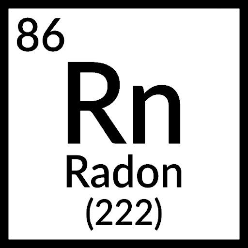

# Radon Games

An open-source unblocked games website built with simplicity in mind.

## How to setup

Clone on Replit:<br>
[](https://repl.it/github/ericksoncohen/radon-games)

In shell:
```
$ git clone https://github.com/ericksoncohen/radon-games
$ cd radon-games
$ npm install
```

Afterward, run:
```
$ npm start
```
The default place for the website is `http://localhost:3000`, but this can be changed in `config.json`.

## Structure


`/views` - <br>
> `/components` - <br>
>> `footer.ejs` - <br>
>> `game.ejs` - <br>
>> `head.ejs` - <br>
>> `nav.ejs` - <br>
>> `search.ejs` - <br>

> `/pages` - <br>
>> `404.ejs` - <br>
>> `game.ejs` - <br>
>> `games.ejs` - <br>
>> `index.ejs` - <br>
>> `report.ejs` - <br>
>> `requst.ejs` - <br>
>> `unlisted-games.ejs` - <br>


`/public` - <br>
> `/css` - <br>
>> `style.css` - <br>
>> `build.css` - <br>
> `/js` - <br>
>> `script.js` - <br>
> `/img` - <br>
>> `logo-512.png` - <br>


`/server` - <br>
> `proxy.js` - <br>
> `routes.js` - <br>

`changes.txt` - <br>
`config.json` - <br>
`seo.json` - <br>
`server.js` - <br>
`TODO.md` - <br>
`version.json` - <br>