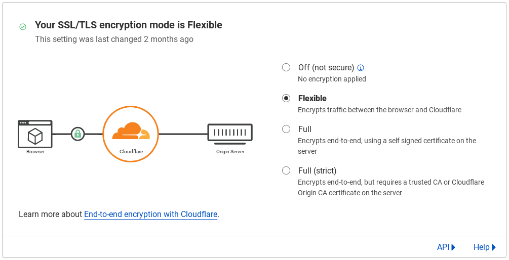

<p align="center">
  
</p>

<h1 align="center">
  Radon Games
</h1>

<p align="center">
  An open-source unblocked games website built with simplicity in mind.
</p>

# Features

- Clean and Easy to use UI
- 300+ Games
- Tab Cloaking / Disguise
-

# Development

## Cloning

```bash
git clone --branch v3 https://github.com/Radon-Games/Radon-Games.git
cd Radon-Games
npm ci
```

## Starting Development Server

The development server has hot module replacement for ease of development. THIS SHOULD NOT BE USED FOR PRODUCTION.

```bash
npm run dev
```

## Building For Production

The build assets will appear in the `/dist/public` directory. You can run the production version with `npm start` although it is reccomended to process these files statically through Caddy [`file_server`](https://caddyserver.com/docs/caddyfile/directives/file_server) API (see more information below).

```bash
npm run build
```

# Configuring Production

The recommended way to configure Radon is through Caddy. Caddy provides an easy to use and understand API for handling HTTP requests. [This repository](https://github.com/Radon-Games/Radon-Games) doesn't contain any game files due to the large file sizes. All the games are hosted on a separate repository found [here](https://github.com/Radon-Games/Radon-Games-Assets).

In order to properly serve these files you need to use a reverse proxy to handle the different routes. Radon also hosts its own [TOMP Bare server](https://github.com/tomphttp/bare-server-node) that needs to be proxied.

## Base Caddy Configuration

Radon uses Caddy [`file_server`](https://caddyserver.com/docs/caddyfile/directives/file_server) API to serve the static files.

```caddy
(radon) {
  tls internal # We also reccomend using cloudflare to proxy requests so SSL doesn't have to be configured on the server
  encode gzip # Apply gzip compression

  ... # Handle game files and Bare server

  handle {
    root * Radon-Games/dist/public
    try_files {path} /index.html # Handle non `/` routes
    file_server
  }
}
```

## Handling Game Files

In order to handle game files you will first have to clone the [assets](https://github.com/Radon-Games/Radon-Games-Assets) repository into your base directory.

```bash
git clone https://github.com/Radon-Games/Radon-Games-Assets.git
```

Once the files have been cloned you have to handle the `/cdn/*` route used by Radon in your Caddy configuration file.

```caddy
(radon) {
  ...

  handle /cdn/* {
    uri strip_prefix /cdn
    root * Radon-Games-Assets
    file_server
  }

  ...
}
```

## Handling the Bare Server

Radon also hosts its own [Bare Server](https://github.com/tomphttp/bare-server-node) in order for proxies to request content.

### Starting Bare Server with pm2

Before we configure Caddy to handle proxied requests we need to set up a Bare Server. We run the bare server using a node process manager called [pm2](https://www.npmjs.com/package/pm2) although it is not required.

```bash
npm i -g pm2 @tomphttp/bare-server-node
pm2 start "bare-server-node --host=127.0.0.1 --port=8080" -n Bare
```

This will start the Bare server in the background but if the server restarts it will not be restarted. In order to fix this we must save the pm2 configuration and tell it to run on startup.

```bash
pm2 save
pm2 startup
```

### Handling Bare requests with Caddy

```caddy
(radon) {
  ...

  handle /bare/* {
    uri strip_prefix /bare
    reverse_proxy 127.0.0.1:8080 # Change port number to the port used by your bare server
  }

  ...
}
```

## The full Caddy snippet

```caddy
(radon) {
  tls internal
  encode gzip

  handle /bare/* {
    uri strip_prefix /bare
    reverse_proxy 127.0.0.1:8080
  }

  handle /cdn/* {
    uri strip_prefix /cdn
    root * Radon-Games-Assets
    file_server
  }

  handle {
    root * Radon-Games/dist/public
    try_files {path} /index.html
    file_server
  }
}
```

## Configuring Domains

We recommend proxying your domains through [Cloudflare](https://cloudflare.com/) in order to help prevent against DDoS attacks and to simplify the number of steps on the server. If you don't know how to setup your domain through Cloudflare please check out the [Cloudflare Docs](https://developers.cloudflare.com/fundamentals/get-started/setup/add-site/).

Once your domain has been added to Cloudflare you should create [`A`](https://www.cloudflare.com/learning/dns/dns-records/dns-a-record/) records pointing to the IP address of your server.

### Connecting your domain to Caddy

Caddy allows for multiple different domains to be handled separately by the same server. This means that by default Caddy isn't going to reply with any information because we haven't told it what domains we want to use.

```caddy
example.com, www.example.com { # List of domains
  import radon
}
```

If you are configuring multiple domains you may want to have Caddy reply to all requests no matter what domain they are coming from, you can tell Caddy to listen on specific ports such as port 80 (default HTTP port).

```caddy
:80 {
  import radon
}
```

Doing this also requires you to change your SSL/TLS encryption mode to `Flexible` from within Cloudflare as your server is no longer serving content through HTTPS.



## Tech Stack

- [SolidJS](https://www.solidjs.com/)
- [Solid Start](https://start.solidjs.com/)
- [Tailwind CSS](https://tailwindcss.com/)
- [Typescript](https://www.typescriptlang.org/)

### Other Libraries Used

- [solid-slider](https://www.npmjs.com/package/solid-slider)
- [fuzzysort](https://www.npmjs.com/package/fuzzysort)
- [vanilla-tilt](https://www.npmjs.com/package/vanilla-tilt)
- [Ultraviolet](https://github.com/titaniumnetwork-dev/Ultraviolet) (proxy)
- [STOMP](https://github.com/sysce/tomp) (proxy)
- [DIP](https://github.com/Dynamic-Interception-Proxy/DIP) (proxy)
